# 🎬 API Movies

> Cada película cuenta una historia... esta API las guarda todas.

**API REST** construida con **Spring Boot** para gestionar un catálogo de películas, con búsqueda por título o género y un modelo de datos relacional que conecta cada película con su género, su reparto y su año de estreno. Desarrollada en **Java 21** con **Spring Data JPA**, y verificada siguiendo **TDD** con **JUnit 5, Mockito, Hamcrest**, con cobertura de tests medida con **JaCoCo**.

---

## 📸 Vista previa

|            Diagrama de Chen             |           Diagrama Crow's Foot            |                           Testing                           |               Cobertura (JaCoCo)                |
| :-------------------------------------: | :---------------------------------------: | :---------------------------------------------------------: | :---------------------------------------------: |
| 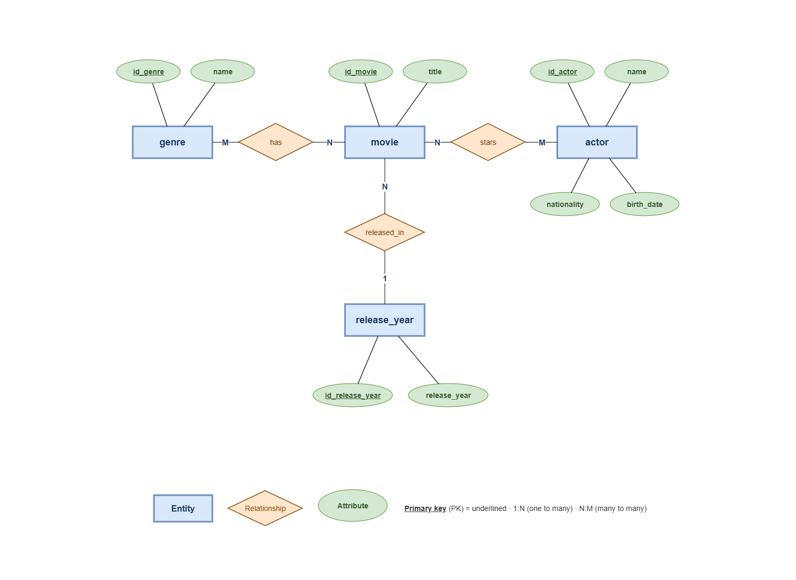 | 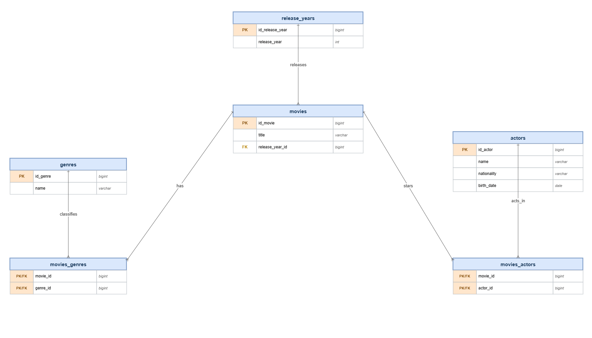 | 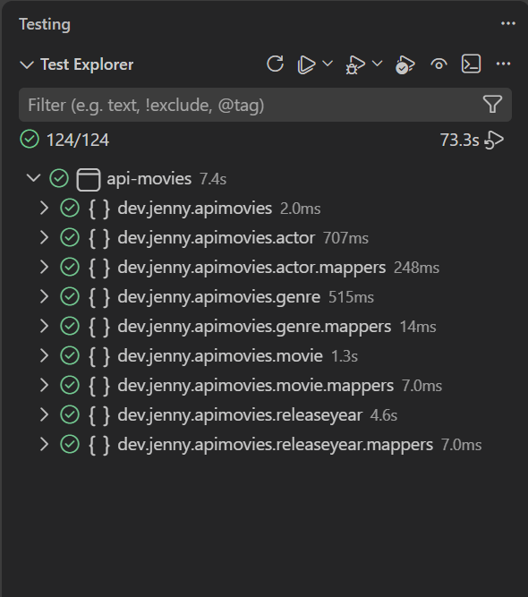 | 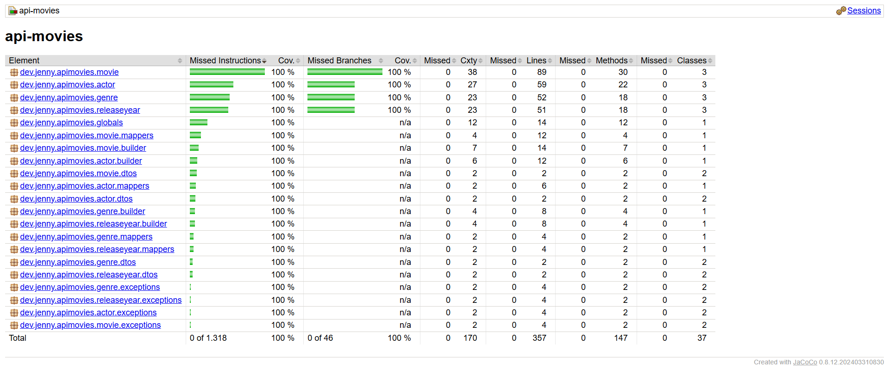 |

---

## 📑 Índice

- [Descripción](#-descripción)
- [Cómo reproducir el proyecto](#-cómo-reproducir-el-proyecto)
- [Modelado de datos y relaciones](#-modelado-de-datos-y-relaciones)
- [Diagramas](#-diagramas)
- [Testing](#-testing)
- [Cobertura de tests](#-cobertura-de-tests)
- [Tecnologías](#-tecnologías)
- [Recursos](#-recursos)
- [Autora](#-autora)

---

## 📋 Descripción

**API Movies** es una API REST para gestionar un catálogo de películas: permite consultar, crear, actualizar y eliminar películas, además de buscarlas por título o género, siguiendo una arquitectura por capas (Controller → Service → Repository → Entity).

Expone seis endpoints sobre el recurso `Movie`:

- **Obtener todas las películas** — lista completa del catálogo
- **Obtener una película por su id** — detalle de una película concreta
- **Añadir una película** — alta de un nuevo registro
- **Actualizar una película** — modificación de una película existente
- **Eliminar una película** — baja de una película
- **Buscar películas por título o género** — endpoint adicional de consulta (`findBy`)

Cada película está relacionada con tres entidades propias:

- **Género** — relación de muchos a muchos (N:M): una película puede tener varios géneros, y un género puede pertenecer a varias películas
- **Actor** — relación de muchos a muchos (N:M), una película puede tener varios actores, y un actor puede aparecer en varias películas
- **Año de estreno** — relación de muchos a uno (N:1): cada película pertenece a un único año, y un año puede agrupar varias películas

Género, actor y año exponen también su propio conjunto de endpoints (listar todas, obtener por id, crear y actualizar); además de servir como catálogo de referencia para construir y relacionar películas, son recursos totalmente gestionables por sí mismos.

El enunciado no especifica el tipo exacto de cada relación, así que lo definí a partir de cómo funciona en la vida real: género y actor son N:M (una película puede tener varios géneros/actores, y un género/actor puede aparecer en varias películas), resueltas con tablas intermedias (`movies_genres`, `movies_actors`); año de estreno es N:1 (cada película tiene un único año), con una relación `@ManyToOne` simple.

La petición para crear o actualizar una película recibe listas de ids de género y actor, y el id del año, en vez de objetos completos — el cliente solo manda referencias, y el servicio las resuelve contra sus repositorios antes de guardar. La respuesta sí devuelve los datos ya resueltos (nombres de género, año, actores) para que sea legible sin peticiones adicionales.

`Genre`, `Actor` y `ReleaseYear` no tienen DELETE ni un endpoint de búsqueda propio, así que los diseñé para `Movie` siguiendo las convenciones REST/Spring oficiales: el DELETE devuelve `204 No Content` y `404` si la película no existe; la búsqueda (`/movies/search?title=&genre=`) acepta ambos parámetros como opcionales.

[Volver al índice](#-índice)

---

## 🚀 Cómo reproducir el proyecto

### Requisitos previos

| Herramienta | Requisito                | Guía de instalación                                                                          |
| ----------- | ------------------------ | -------------------------------------------------------------------------------------------- |
| JDK 21      | Instalado y en el `PATH` | [Ver guía](https://docs.oracle.com/en/java/javase/21/install/overview-jdk-installation.html) |
| Git         | Instalado                | [Ver guía](https://git-scm.com/downloads)                                                    |

> No hace falta instalar Maven aparte — el proyecto incluye el wrapper (`mvnw` / `mvnw.cmd`), que descarga la versión correcta automáticamente.

### Pasos

1. Comprueba que tienes Java instalado (si el comando no se reconoce, instálalo desde el enlace de Requisitos previos):

```bash
   java --version
```

2. Clona el repositorio:

```bash
   git clone https://github.com/Jennydev-25/api-movies.git
```

3. Entra en la carpeta del proyecto:

```bash
   cd api-movies
```

4. Ejecuta los tests (compila y genera el reporte de cobertura de JaCoCo):

```bash
   ./mvnw clean test
```

El reporte de cobertura se genera en `target/site/jacoco/index.html`, que puedes abrir en el navegador.

5. Levanta la aplicación:

```bash
   ./mvnw spring-boot:run
```

La API queda disponible en `http://localhost:8080/api/v1/movies` (y el resto de recursos bajo el mismo prefijo `/api/v1`), ya con el catálogo de 22 películas cargado.

[Volver al índice](#-índice)

---

## 🗄️ Modelado de datos y relaciones

El modelo está formado por cuatro entidades principales y dos tablas intermedias para resolver las relaciones de muchos a muchos (N:M).

**`movies`** — las películas del catálogo

- `id_movie` (PK)
- `title`
- `release_year_id` (FK)

**`genres`** — catálogo de géneros cinematográficos

- `id_genre` (PK)
- `name`

**`actors`** — catálogo de actores principales

- `id_actor` (PK)
- `name`
- `nationality`
- `birth_date`

**`release_years`** — catálogo de años de estreno

- `id_release_year` (PK)
- `release_year`

**`movies_genres`** — tabla de unión (relación N:M) entre películas y géneros

- `movie_id` (PK, FK)
- `genre_id` (PK, FK)

**`movies_actors`** — tabla de unión (relación N:M) entre películas y actores

- `movie_id` (PK, FK)
- `actor_id` (PK, FK)

### 🔗 Relaciones del modelo

- Un año de estreno puede agrupar muchas películas, pero cada película tiene un único año (**1:N**)
- Una película puede tener varios géneros, y un género puede pertenecer a varias películas (**N:M**), resuelto mediante `movies_genres`
- Una película puede tener varios actores, y un actor puede aparecer en varias películas (**N:M**), resuelto mediante `movies_actors`

### 🔑 Claves primarias y foráneas

| Tabla           | Clave primaria         | Clave(s) foránea(s) |
| --------------- | ---------------------- | ------------------- |
| `movies`        | `id_movie`             | `release_year_id`   |
| `genres`        | `id_genre`             | —                   |
| `actors`        | `id_actor`             | —                   |
| `release_years` | `id_release_year`      | —                   |
| `movies_genres` | `movie_id`, `genre_id` | Ambas               |
| `movies_actors` | `movie_id`, `actor_id` | Ambas               |

[Volver al índice](#-índice)

---

## 📊 Diagramas

Representación visual del modelo de datos en dos notaciones distintas:

### 🔷 Diagrama de Entidad-Relación (Chen)

Representa el modelo conceptual, mostrando las entidades principales y cómo se relacionan entre sí. Entidades (rectángulos), relaciones (rombos) y atributos (elipses), con las claves primarias subrayadas


### 🔗 Diagrama de patas de gallo (Crow's Foot)

Representa el esquema físico de la base de datos con las seis tablas (incluidas las tablas puente), sus campos, claves y relaciones


<details>
<summary>Versión en Mermaid</summary>

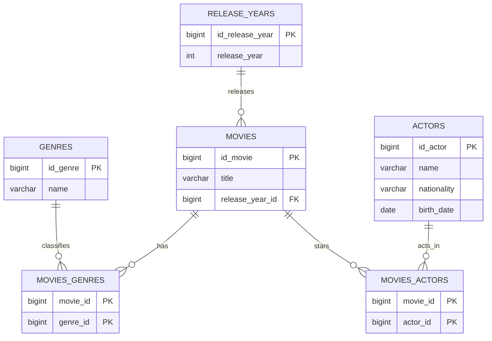
```mermaid
erDiagram
    RELEASE_YEARS ||--o{ MOVIES : "releases"
    GENRES ||--o{ MOVIES_GENRES : "classifies"
    MOVIES ||--o{ MOVIES_GENRES : "has"
    MOVIES ||--o{ MOVIES_ACTORS : "stars"
    ACTORS ||--o{ MOVIES_ACTORS : "acts_in"

    RELEASE_YEARS {
        bigint id_release_year PK
        int release_year
    }
    MOVIES {
        bigint id_movie PK
        varchar title
        bigint release_year_id FK
    }
    GENRES {
        bigint id_genre PK
        varchar name
    }
    ACTORS {
        bigint id_actor PK
        varchar name
        varchar nationality
        date birth_date
    }
    MOVIES_GENRES {
        bigint movie_id PK
        bigint genre_id PK
    }
    MOVIES_ACTORS {
        bigint movie_id PK
        bigint actor_id PK
    }
```

</details>

[Volver al índice](#-índice)

---

## 🧪 Testing

El proyecto sigue TDD con JUnit 5, Mockito y Hamcrest. Cada entidad tiene su propia batería de tests por capa:

- **Controller** — `@WebMvcTest` + `MockMvc`, simulando peticiones HTTP y verificando respuestas y códigos de estado.
- **Service** — `@ExtendWith(MockitoExtension.class)`, mockeando el repositorio para aislar la lógica de negocio.
- **Entity** — tests unitarios sobre constructores, getters y setters.
- **Mapper** — verifican la conversión correcta entre entidad y DTO.

Además, `AppTest` levanta el contexto completo de Spring Boot (`@SpringBootTest`), comprobando que la aplicación arranca correctamente con el esquema y los datos semilla ya cargados.

| Paquete                               | Controller | Service | Entity | Mapper | Total   |
| ------------------------------------- | ---------- | ------- | ------ | ------ | ------- |
| `genre`                               | 11         | 8       | 3      | 3      | 25      |
| `actor`                               | 11         | 8       | 3      | 3      | 25      |
| `releaseyear`                         | 11         | 8       | 3      | 3      | 25      |
| `movie`                               | 14         | 15      | 3      | 3      | 35      |
| Arranque de la aplicación (`AppTest`) | —          | —       | —      | —      | 1       |
| **Total**                             |            |         |        |        | **111** |

### 🖥️ Capturas del Test Explorer


| Paquete        | Clase      | Captura                                                            |
| -------------- | ---------- | ------------------------------------------------------------------ |
| `genre`        | Controller | 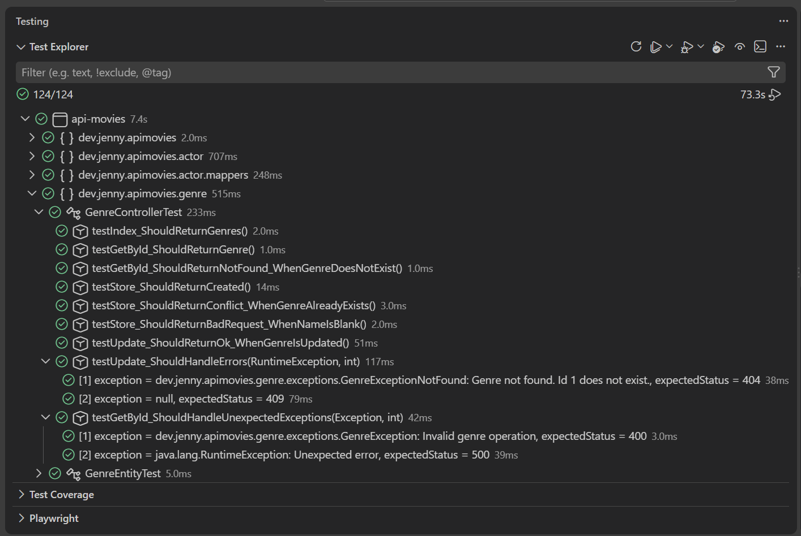        |
| `genre`        | Service    | 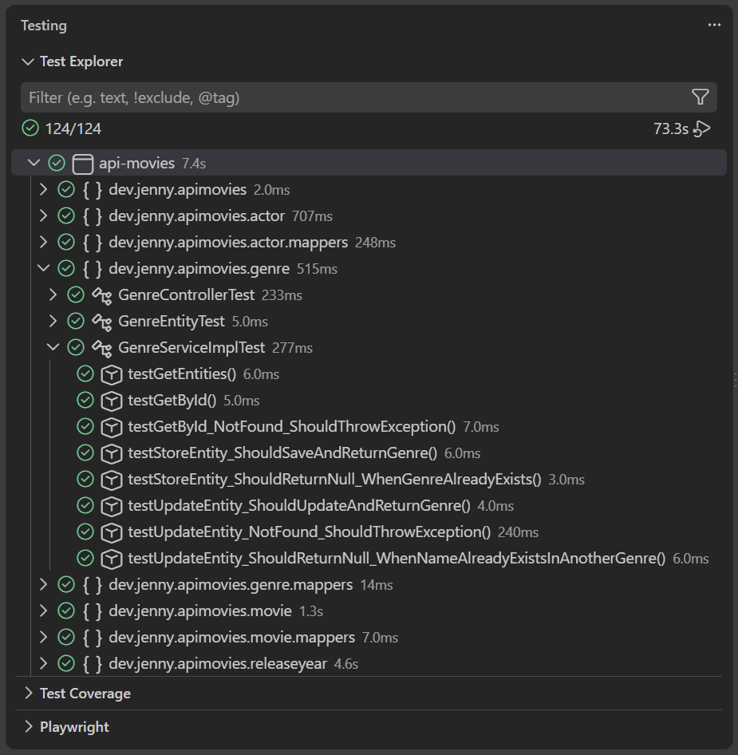           |
| `genre`        | Entity     | 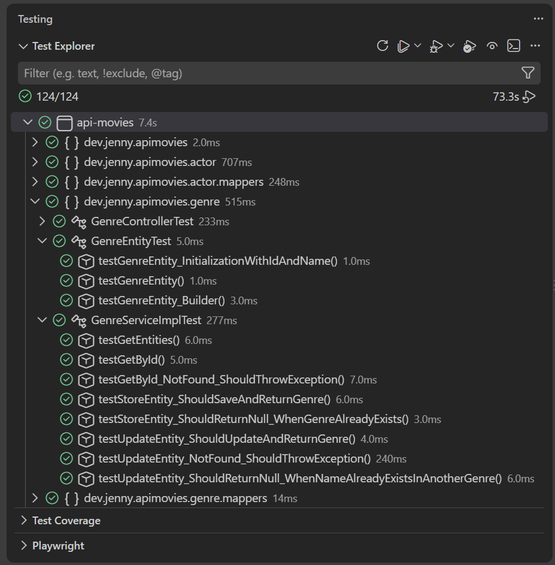            |
| `genre`        | Mapper     | 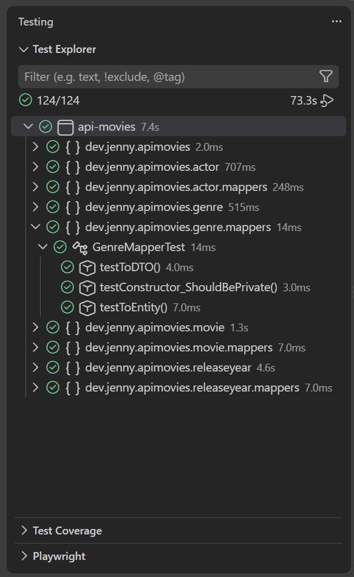            |
| `actor`        | Controller | 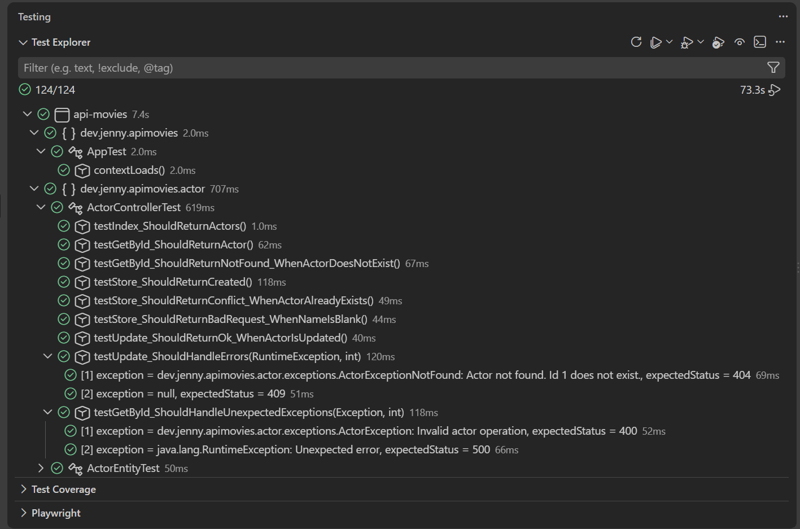        |
| `actor`        | Mapper     | 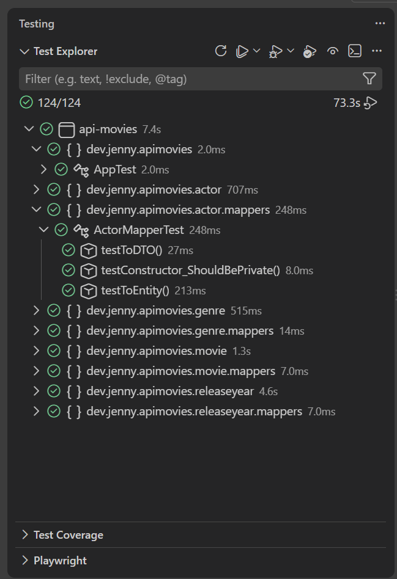            |
| `movie`        | Controller | 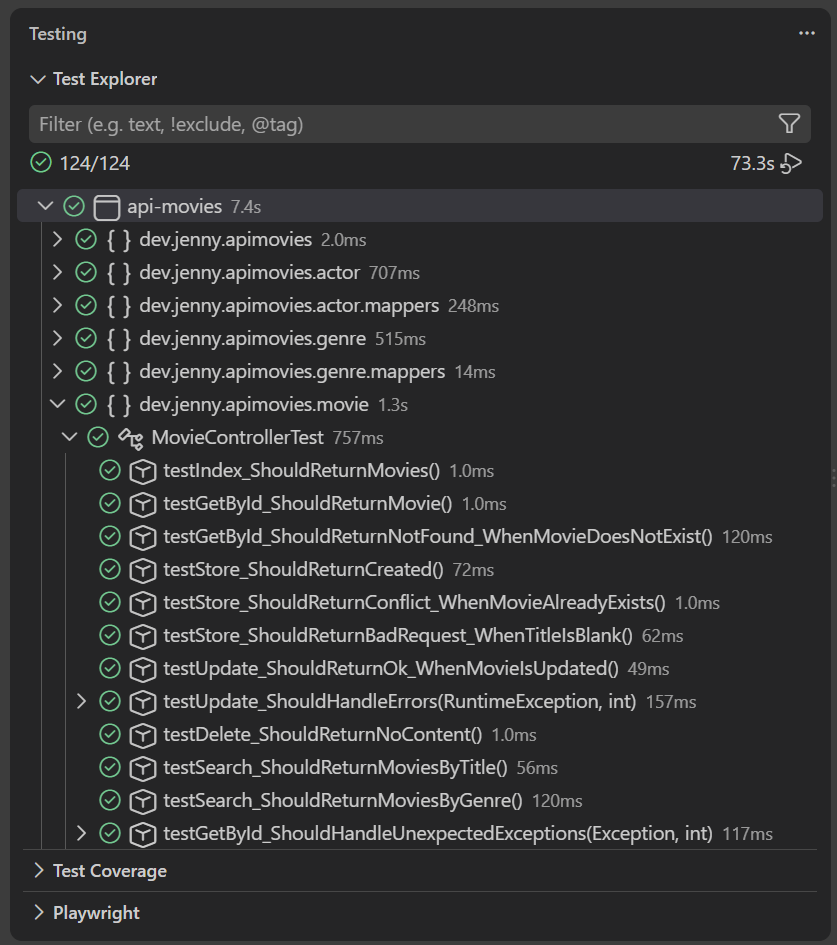        |
| `movie`        | Service    | 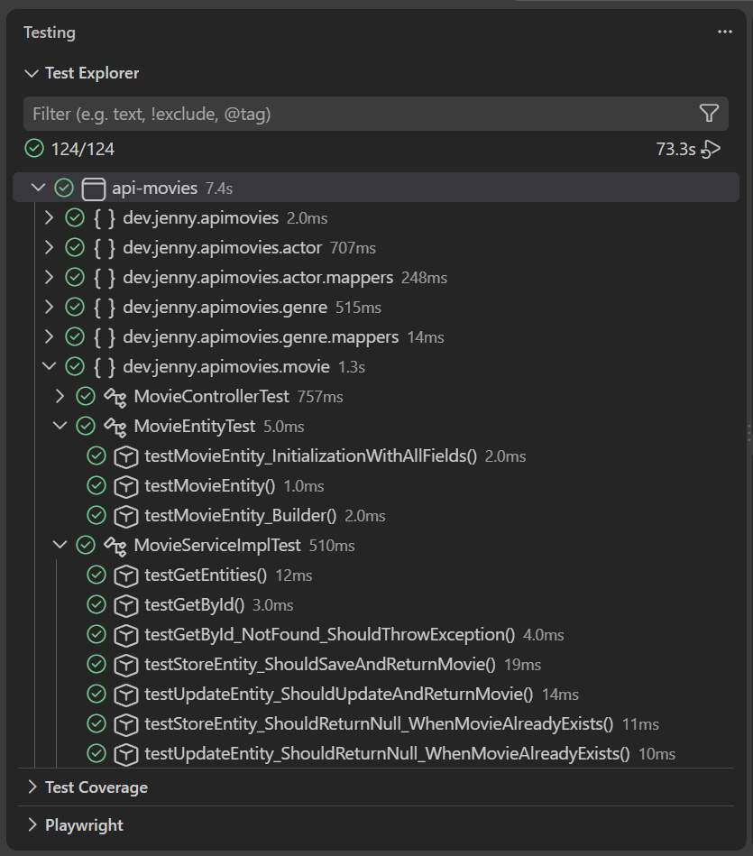           |
| `movie`        | Mapper     | 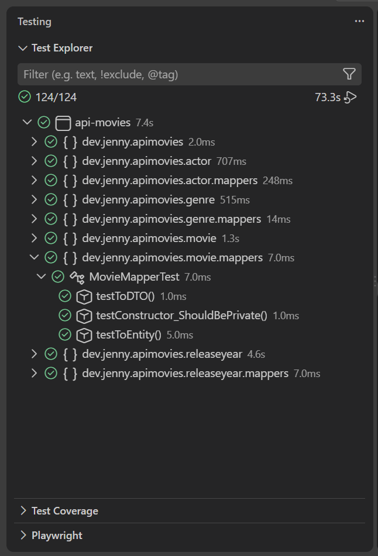            |
| `release_year` | Controller | 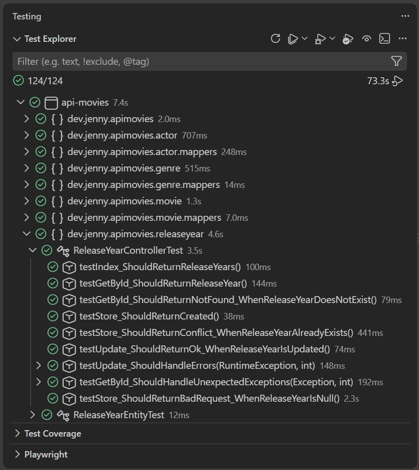 |
| `release_year` | Service    | 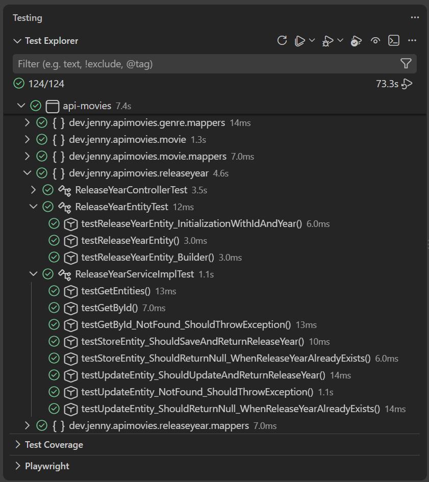    |
| `release_year` | Mapper     | 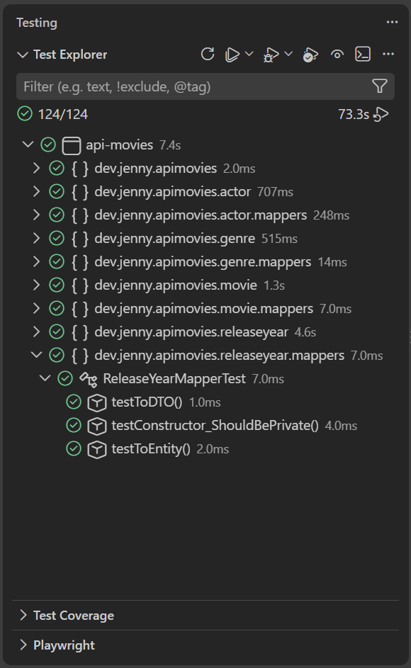     |

> **Nota:** el Test Explorer de VS Code muestra 124/124, mientras que la tabla de totales de más arriba indica 111. La diferencia es porque VS Code cuenta cada caso de los tests parametrizados (`@ParameterizedTest`) como una entrada aparte además del test padre; el número real de tests ejecutados, según Maven Surefire, es 111.

[Volver al índice](#-índice)

---

## 📈 Cobertura de tests

El proyecto mantiene el 100% de cobertura en instrucciones, ramas, líneas y métodos, medido con JaCoCo. La clase de arranque de Spring Boot (`App.class`, que solo contiene el `main`) se excluye de la medición por ser código de arranque sin lógica propia (ver `pom.xml`)

| Métrica           | Cobertura  |
| ----------------- | ---------- |
| Instrucciones     | 100 %      |
| Ramas             | 100 %      |
| Líneas            | 357 de 357 |
| Métodos           | 147 de 147 |
| Clases analizadas | 37         |


> El reporte completo, navegable por clase, se genera en `target/site/jacoco/index.html` tras ejecutar `./mvnw clean test` (ver [Cómo reproducir el proyecto](#-cómo-reproducir-el-proyecto))

[Volver al índice](#-índice)

---

## 🛠️ Tecnologías

- **[Java 21](https://www.oracle.com/java/technologies/downloads/)** — Lenguaje de programación del proyecto
- **[Spring Boot](https://spring.io/projects/spring-boot)** — Framework para construir la API REST
- **[Spring Web](https://docs.spring.io/spring-framework/reference/web.html)** — Exposición de los endpoints HTTP
- **[Spring Data JPA](https://spring.io/projects/spring-data-jpa)** — Acceso a datos y mapeo objeto-relacional
- **[H2 Database](https://www.h2database.com/)** — Base de datos en memoria para desarrollo y test
- **[Bean Validation](https://beanvalidation.org/)** — Validación de los datos de entrada
- **[Apache Maven](https://maven.apache.org/)** — Gestor de dependencias y construcción del proyecto
- **[JUnit 5](https://junit.org/junit5/)** — Framework de tests unitarios
- **[Mockito](https://site.mockito.org/)** — Mocks para los tests de servicio
- **[Hamcrest](https://hamcrest.org/JavaHamcrest/)** — Librería de matchers para aserciones legibles
- **[JaCoCo](https://www.jacoco.org/jacoco/)** — Medición de la cobertura de tests
- **[Git](https://git-scm.com/)** / **[GitHub](https://github.com/)** — Control de versiones y alojamiento del proyecto

[Volver al índice](#-índice)

---

## 📚 Recursos

- [Spring Data JPA — Reference Documentation](https://docs.spring.io/spring-data/jpa/reference/) — Documentación oficial consultada para las relaciones `@ManyToMany`/`@ManyToOne` y `@JoinTable` entre `Movie`, `Genre`, `Actor` y `ReleaseYear`

* [Spring Boot — Data Initialization](https://docs.spring.io/spring-boot/reference/howto/data-initialization.html) — Documentación oficial sobre `spring.jpa.defer-datasource-initialization=true`, para que Hibernate cree el esquema antes de ejecutar `data.sql`

- [JUnit 5 User Guide](https://junit.org/junit5/docs/current/user-guide/) — Documentación oficial de JUnit 5 aplicada en los tests de Controller y Service
- [Parameterized Tests in JUnit 5 (Baeldung)](https://www.baeldung.com/parameterized-tests-junit-5) — Patrón aplicado en los tests de manejo de excepciones con `@ParameterizedTest` + `@MethodSource`
- [Hamcrest – JavaHamcrest](https://hamcrest.org/JavaHamcrest/) — Documentación de los matchers usados en las aserciones de los tests
- [Mockito](https://site.mockito.org/) — Mocks de repositorios y servicios en los tests unitarios
- [JaCoCo Maven Plugin](https://www.jacoco.org/jacoco/trunk/doc/maven.html) — Configuración del plugin de cobertura y de la exclusión de `App.class`
- [Error Handling for REST with Spring (Baeldung)](https://www.baeldung.com/exception-handling-for-rest-with-spring) — Base para el `GlobalExceptionHandler` con `@RestControllerAdvice`
- [Jakarta Bean Validation](https://beanvalidation.org/) — Anotaciones `@NotBlank`/`@NotNull` en los DTOs de entrada
- [MDN — HTTP response status codes](https://developer.mozilla.org/en-US/docs/Web/HTTP/Status) — Criterio para devolver `204 No Content` en el DELETE y `404` cuando el recurso no existe

---

## 👩💻 Autora

**[Jenny Sánchez Requejo](https://github.com/Jennydev-25)**

[Volver arriba](#-api-movies)
